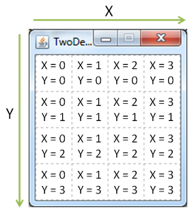
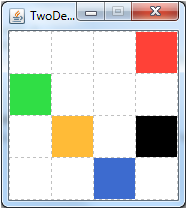
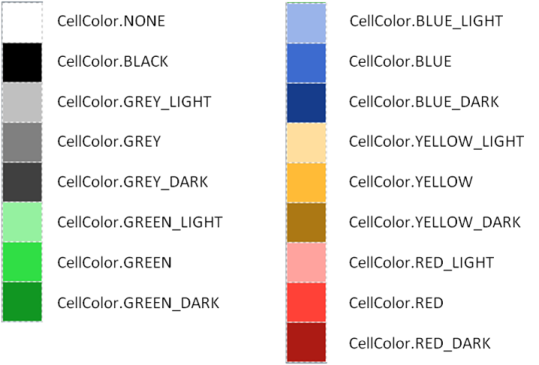
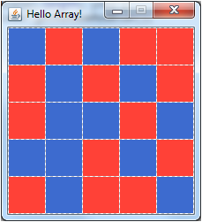

# Instructions for TwoDeeGrid

## What is TwoDeeGrid?

The `TwoDeeGrid` is a graphical environment for experimenting in Java. It consists of a Grid of square coloured cells that can be altered programmatically.


It has the following main features:

* Creating grids of arbitrary size
* Colouring the cells in different ways
* Input from keyboard and mouse
* Waiting time spans

## First Steps

### Download and Installation

Copy the current version from [here](https://raw.github.com/zyxxylabs/TwoDeeGrid/master/dist/TwoDeeGrid.zip)  and unpack the archive.

Create a Java-Project in Eclipse in drag the file `twodeegrid.jar` onto the project-name in the Package Explorer on the left side. In the following dialog select the option *Copy files* and click *OK*.

`twodeegrid.jar` should now appear in your project. Now, the library must be made usable for your own programs: Right-click `twodeegrid.jar` and select the menu entry *Build Path -> Add to build path*.

You can create your own classes via the menu *File -> New -> Class". Insert the following code as the first line after your package declaration:

``` {.java}
import twodeegrid.*;
```

### "Hello World"

A simple code example: First the grid is initialized to consist of 3x3 cells and the have the window title "Hello World". Then the upper left cell (coordinate X=0, Y=0) is coloured red:

``` {.java}
import twodeegrid.*;

public class HelloWorld {
	private static void main(String[] args) {
		TwoDeeGrid g = new TwoDeeGrid(3, 3, "Hello World");
		g.setColorAt(0, 0, CellColor.RED);
	}
}
```

The result when running the program:


The grid stays on screen after the main-method finishes execution. The program is only finished when the window is manually closed by clicking on the close-symbol.

### The Grid


The Grid consists of square cells, that can be adressed using their horizontal (X) and their vertical (Y) coordinate. Coordinates are counted starting with 0. The upper left corner ist X=0, Y=0.


### Initializing the Grid
The grid can be initialized and shown by creating a `TwoDeeGrid` Object. Two different constructors are defined:

``` {.java}
public TwoDeeGrid()
public TwoDeeGrid(int xSize, int ySize, String title)
```

The first variant creates a standard grid with the size 8x8. The second constructor can be used to define an arbitrarily sized grid with a specific windwo title. The size of the single cells is adapted automatically depending on the screen resolution.

## Cell Colors

### Setting Cell Colors
``` {.java}
public void setColorAt(int x, int y, CellColor color)
```

`setColorAt` colors the cell with the coordinate 'x' and 'y'. The third parameter is the cell color to set. The color can be given directly based on color constants (see [Color Constants](#color-constants)) or generated randomly using different provided methods (see [Random Colors](#random-colors)).

All coordinate values are calculated *modulo* the size of the `TwoDeeGrid`. This means that for a coordinate x equal or larger the size of the raster, counting restarts at the left side of the grid. A value smaller than 0 adresses a cell counting from the right side of the `TwoDeeGrid`.

The following example...

``` {.java}
TwoDeeGrid g = new TwoDeeGrid(4,4, "TwoDeeGrid");
g.setColorAt(1, 3, CellColor.YELLOW);
g.setColorAt(-1, 0, CellColor.RED);
g.setColorAt(4, 1, CellColor.GREEN);
g.setColorAt(2, -1, CellColor.BLUE);
g.setColorAt(103, 2, CellColor.BLACK);
```

...yields:
		


``` {.java}
public void clear()
```

`clear()` deletes the grid and resets its values to their white base color.

### Reading Cell Colors

``` {.java}
CellColor getColorAt(int x, int y)
```

returns the color at position x,y. Der value can be compared with the predefined [constants](#color-constants). 

Example:

``` {.java}
if (g.getColorAt(1, 3) == CellColor.YELLOW) {
  // Your Program here...
}
```

### Color Constants

All color constants are provided by the class `CellColor`:



The white cell color plays a special role: It stands for a uncolored cell in the grid. Its constant is `CellColor.NONE`.

Example:

``` {.java}
TwoDeeGrid g = new TwoDeeGrid(3, 3, "Hello World");
g.setColorAt(1, 1, CellColor.GREEN_LIGHT);
```

### Random Colors

Color values can be created randomly: 

``` {.java}
public static CellColor getRandomCellColor() 
```

...returns a `CellColor`-object of random color.

``` {.java}
public static CellColor getRandomRedBlue() 
```

...randomly returns `CellColor.RED` or `CellColor.BLUE`.

``` {.java}
public static CellColor getRandomOnOff() 
```

...randomly returns `CellColor.NONE` or `CellColor.BLACK`.

``` {.java}
public static CellColor getRandomOnOff(double probabilityOn) 
```


...randomly returns `CellColor.NONE` or `CellColor.BLACK`. The parameter `probabilityOn` is the probability that the returned value is "on" (e.g. black). 0.0 means 0% probability, 1.0 means 100% probability, 0.5 is 50%,...


## Working with the Grid as an Array

``` {.java}
public CellColor[][] getCellArray()
```

returns a copy of the whole `TwoDeeGrid` as a two-dimensional array of color values (`CellColor`). The array can be altered freely. Changes will not instantly get visible, but can be given back to the grid with the following method:

``` {.java}
public void updateCellArray(CellColor[][] cells)
```

Using the array instead of working with `getColorAt()` und `setColorAt()` pays off when a large number (or all) cells should be altered at once.

The following code example...

``` {.java}
TwoDeeGrid g = new TwoDeeGrid(5, 5, "Hello Array!");

CellColor[][] cells = g.getCellArray();

for (int x = 0; x < cells.length; x++) {
  for (int y = 0; y < cells[x].length; y++) {
    cells[x][y] = CellColor.getRandomRedBlue();
  }
}
		
g.updateCellArray(cells);
```

...yields:




## Keeping Track of Time

``` {.java}
public void waitTime(double time)
```

stops the program execution for a given time span. The parameter `time` sets the time spand  in seconds. 

`waitTime` can be used for dynamics changes or animations. The following example creates a grid with a blinking red square in the middle:


``` {.java}
TwoDeeGrid g = new TwoDeeGrid(3, 3, "Blink!");

while(true) {
  g.setColorAt(1, 1, CellColor.RED);
  g.waitTime(0.3);
  g.setColorAt(1, 1, CellColor.NONE);
  g.waitTime(0.6);
}
```

## User Input

A program can be made interactive via user input. `TwoDeeGrid` has two possibilities: mouse (or touchscreen) input and the keyboard.

### Mouse Input

``` {.java}
public MouseClick waitMouseClick()
```

waits until the user clicks on a cell. The method then returns an object of type `MouseClick`.

`MouseClick` holds information about the click that can be accessed using the following methods:

``` {.java}
public int getX()
public int getY()
public int getType()
```

`getX()` and `getY()` return the X- and Y-coordinate of the selected cell. `getType()` returns which mouse button was pressed: the left (`MouseClick.LEFT`), the right (`MouseClick.RIGHT`) or the middle (`MouseClick.MIDDLE`) mouse button.

The following example allows to paint on the grid using the mouse:
``` {.java}
public static void main(String[] args) {
  TwoDeeGrid g = new TwoDeeGrid(5,5, "TwoDeeGrid");
  
  while(true) {
    MouseClick click = g.waitMouseClick();
    g.setColorAt(click.getX(), click.getY(), CellColor.getRandomCellColor());
  }
}
```

### Keyboard Input

``` {.java}
public int getKeyPressed()
```

returns the last key that has been pressed on the keyboard. Contrary to `waitMouseClick()` `getKeyPressed()` does *not* wait until a key has been pushed.

The different key pressed events are encoded in the JDK class [`KeyEvent`](http://docs.oracle.com/javase/7/docs/api/java/awt/event/KeyEvent.html). If no key was pressed `KeyEvent.CHAR_UNDEFINED` is returned.

The following example opens a narrow window. The green square can be moved left and right using the arrow keys:

``` {.java}
TwoDeeGrid g = new TwoDeeGrid(9, 1, "Press LEFT/RIGHT");
int pos = 4; 
int key;

while (true) {
  g.clear();
  g.setColorAt(pos, 0, CellColor.GREEN);
  
  do {
    key = g.getKeyPressed();
  } while (key == KeyEvent.CHAR_UNDEFINED);
  
  switch (key) {
  case KeyEvent.VK_LEFT:
    pos--;
    break;
  case KeyEvent.VK_RIGHT:
    pos++;
    break;
  }
}
```


## Reference (Classes and Methods)

### TwoDeeGrid

* `public TwoDeeGrid(int xSize, int ySize, String title)` \
  Creates a grid with dimensions `xSize` x `ySize` and the title `title`.

* `public TwoDeeGrid()` \
  Creates a grid with dimensions 8x8.

* `public int getGridSizeX()`\
  Returns the rasters width (number of cells).

* `public int getGridSizeY()`\
  Returns the rasters height (number of cells).

* `public CellColor getColorAt(int x, int y)`\
  Returns the color value at position (`x`,`y`). (0, 0) means the upper left corner.

* `public void setColorAt(int x, int y, CellColor color)`\
  Sets the color value at position (`x`,`y`) to `color`. (0, 0) means the upper left corner.

* `public void clear()`\
  Clears the grid and colors all cells white.

* `public CellColor[][] getCellArray()`\
  Returns the grid as a two-dimensional array. The color values can be accessed with `cell[x][y]`.

* `public void updateCellArray(CellColor[][] cells)`\
  Sets the grid cells to the color values in the array `cells`.

* `public void waitTime(double time)`\
  Waits `time` seconds.

* `public MouseClick waitMouseClick()`\
  Waits until one of the cells was clicked. Returns an object with additional information.

* `public int getKeyPressed()`\
  Returns the keycode for the last pressed key. The keys codes are defined in [`KeyEvent`](http://docs.oracle.com/javase/7/docs/api/java/awt/event/KeyEvent.html).


### CellColor

* `public static CellColor getRandomCellColor()`\
  Returns a random color value.

* `public static CellColor getRandomRedBlue()`\
  Randomly returns `CellColor.RED` or `CellColor.BLUE`.

* `public static CellColor getRandomOnOff()`\
  Randomly returns `CellColor.BLACK` or `CellColor.NONE`.

* `public static CellColor getRandomOnOff(double probabilityOn)`\
  Randomly returns `CellColor.BLACK` (with probability `probabilityOn`) or `CellColor.NONE` (with probability `1 - probabilityOn`).
  
Defined color constants: see [Color Constants](#color-constants).

### MouseClick

* `public int getX()`\
  X-coordinate of the clicked cell.

* `public int getY()`\
  Y-coordinate of the clicked cell.

* `public int getType()`\
  pushed mouse button (`MouseClick.LEFT`, `MouseClick.RIGHT` or `MouseClick.MIDDLE`).