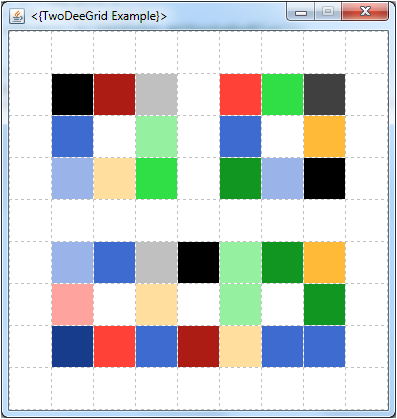

# TwoDeeGrid

A playground for learning Java.

## What is TwoDeeGrid?

The `TwoDeeGrid` is a graphical environment for experimenting in Java. It consists of a Grid of square coloured cells that can be altered programmatically.

It has the following main features:

* Creating grids of arbitrary size
* Colouring the cells in different ways
* Input from keyboard and mouse
* Waiting time spans

**Learn more:** [Instructions in English](ReadMe_EN.html) - [Anleitung auf Deutsch](ReadMe_DE.html)